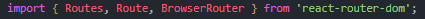
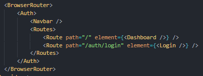
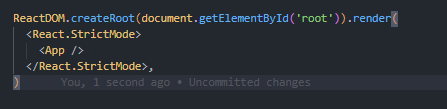

2.1) ¿Cómo implementarías las acciones del frontend utilizando redux? (por ejemplo autenticación, solicitud de clientes activos para el usuario y solicitud de casos por cliente)

Dividiría los reducers por responsabilidad.
Por ejemplo uun reducer "session" donde manejaría la autenticación donde tendría la infomación
del usuario y su status de logueado.

En otro reducer manejaría la infomación que preciso utilizar en mi aplicación.
Por ejemplo clientes, bots, etc.

- Redux está implementado en este desarrollo.

2.2) Si quisiéramos agregar una ruta nueva a la app, ¿cómo reestructurarías el index.js?

1 - Al mismo nivel del archivo index.js creo el archivo App.tsx

2 - Instalar react-router-dom

```
npm install react-router-dom
```

3 - Dentro de App importo Browser Router, Routes y Route.

<div align="left">



</div>

4 - Envuelvo las rutas dentro de Browser Router

<div align="left">



</div>

5 - Reestucturo index.js

<div align="left">



</div>

cambio el ReactDOM.render (deprecado) por React.DOM.createRoot(mi div root).render( React stric mode - App - / React stric mode )

- Estos pasos mencionados fueron aplicados y estan en el código.